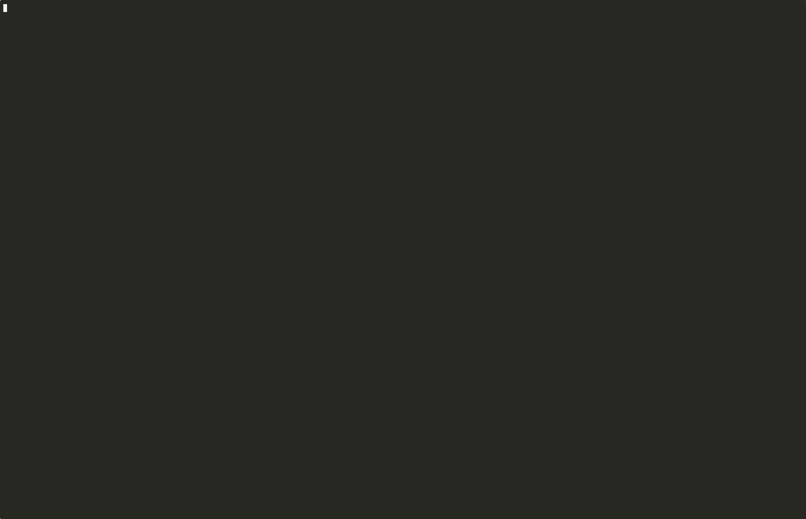

<p align="center">
  <h1 align="center">🧠 MELLM — Lightweight Modular AI Routing Engine</h1>
  <p align="center">
    Run multiple small, domain-specialized LLMs instead of one massive general model.<br/>
    Better answers. Less VRAM. Faster responses.
  </p>
  <p align="center">
    
    
    
    
    
    
    
    
  </p>
  
</p>

## ⚡ TL;DR

MELLM is a lightweight AI router that:
- **Uses a small model** to classify queries with high precision.
- **Routes them to domain-specific experts** (code, math, medical, legal).
- **Conserves VRAM** by keeping only one expert model active at a time.

👉 **Better accuracy** than small general models  
👉 **Runs on 6GB GPUs** (RTX 3050, GTX 1060)  
👉 **No more waiting** for massive 70B models to layer-stream

---

## 🔍 What is MELLM?

Large general-purpose models are trained to know everything — which means they're not optimised for anything in particular. A 70B general model answering a medical question is overkill on resources and often outperformed by a 7B model that was fine-tuned specifically on medical literature.

Meanwhile, running models larger than 14B is completely out of reach on consumer hardware like a 6GB GPU. You're stuck choosing between a small general model that gives mediocre answers, or a large specialist model you can't run.

**MELLM solves this differently.**

Instead of running one large model, MELLM runs a tiny **router model** that reads your query, identifies the domain, and loads the right **specialist model** — a small model fine-tuned specifically for that task. When you ask a medical question, you get a medical model. When you ask for code, you get a code model. When your query spans multiple domains, MELLM decomposes it and runs each part through the appropriate specialist simultaneously.

The result: **expert-level answers from models that fit on your GPU**, at a fraction of the compute cost of running a monolithic large model.
```
User query → Router (1.5B) → identifies domain → loads specialist (1.5–7B)
                                                 → generates response
                                                 → unloads, ready for next query
```

This architecture isn't just a consumer hardware workaround — it's a fundamentally more efficient approach. The same principle applies at production scale: routing to purpose-built specialists is cheaper and more accurate than throwing a 70B general model at every query.

### The numbers

| Approach | Model needed | VRAM | Query time | Domain accuracy |
|----------|-------------|------|------------|-----------------|
| General monolithic | 14B–70B | 16–80 GB | minutes | moderate |
| **MELLM specialist routing** | **1.5B–7B** | **6 GB** | **8–20s** | **high** |

A domain-specific 7B model can often outperform a larger general model on tasks within its specialty — while using significantly less compute.

## 🧠 Traditional vs MELLM

| Feature | Traditional LLM | MELLM |
| :--- | :--- | :--- |
| **Models used** | 1 large monolithic model | Multiple small experts |
| **VRAM usage** | Always high (OOM risk) | Minimal (fit on consumer GPUs) |
| **Accuracy** | Generalist / Average | Domain-optimized / Expert |
| **Efficiency** | Low (brute-force scaling) | High (intelligent routing) |

## 💡 Why this matters

Running large LLMs locally is expensive and often impractical. MELLM shows that:
- **You don’t need a single massive model** to get expert answers.
- **You can orchestrate experts** to achieve better results with less hardware.
- **Efficient routing** beats brute-force scaling every time.

This opens the door to local AI systems on consumer hardware, modular architectures that grow with your needs, and lower-cost deployment at scale.

### Key Features

- 🔀 **Intelligent Routing** — A 1.5B router classifies queries into 5 domains with >90% accuracy and rewrites prompts for optimal specialist output
- 🧩 **Multi-Agent Composition** — Cross-domain queries are automatically decomposed, each part routed to the right specialist, and merged into one response
- 🧬 **Domain Specialists** — Fine-tuned models for medical, legal, math, code, and general knowledge — each optimised for its task
- ⚡ **Persistent Router** — Router stays resident in VRAM; zero routing overhead after startup
- 🔥 **Hot Specialist Cache** — Active specialist stays loaded between same-domain queries; only swapped on domain switch
- 🧠 **Conversation Context** — 3-turn history window so follow-up queries like "Now in Python?" work correctly
- 🎯 **Domain Continuity** — Short follow-ups inherit the current domain automatically
- 🖥️ **Interactive Setup Wizard** — Hardware-aware onboarding detects your GPU and recommends appropriate model sizes
- 🌐 **REST API** — FastAPI endpoint so any app can use MELLM as a backend
- ⬇️ **Auto-Download** — Models download from Hugging Face on first use, cached locally

---

## 🏗️ Architecture

```
                      ┌──────────────────────────────────────┐
                      │   STARTUP — once per session         │
                      │   Router (1.5B Qwen) loads into VRAM │
                      └──────────────────┬───────────────────┘
                                         │ stays resident ↓
┌──────────────┐    ┌─────────────┐    ┌─────────────────────┐
│  User Query  │───▶│  Add context│───▶│  Router: Classify   │
│              │    │  (last 3    │    │  domain + rewrite   │
│              │    │   turns)    │    │  prompt (JSON mode) │
└──────────────┘    └─────────────┘    └──────────┬──────────┘
                                                   │
                               domain continuity   │
                               bias applied here   │
                                                   ▼
              ┌────────────────────────────────────────────────┐
              │  Hot Cache Check                               │
              │  Same domain? → reuse loaded specialist (0s)   │
              │  New domain?  → unload old, load new (1-6s)    │
              └───────────────────┬────────────────────────────┘
                                   │
          ┌────────────────────────▼──────────────────────────┐
          │  Specialist generates response (stays in VRAM)    │
          │  History appended → available for next query      │
          └───────────────────────────────────────────────────┘
```

### VRAM Strategy

MELLM uses a **two-tier residency** model to maximize responsiveness within 6GB VRAM:

| Model | Residency | Why |
|-------|-----------|-----|
| **Router** (1.5B) | Always in VRAM | ~1 GB, permanent resident; no per-query overhead |
| **Active Specialist** | In VRAM until domain changes | Only one specialist at a time; swapped on domain switch |
| **Other Specialists** | On disk (GGUF cache) | Loaded on-demand in 1-6s |

---

## 📋 Model Registry

All models use the **GGUF** quantized format for efficient inference via `llama-cpp-python`.

| Role | Domain | Model | GGUF File | Size | Context |
|------|--------|-------|-----------|------|---------|
| **Router** | All | Qwen2.5-**1.5B**-Instruct | `qwen2.5-1.5b-instruct-q4_k_m.gguf` | ~1 GB | 4096 |
| Specialist | **Code** | Qwen2.5-Coder-1.5B-Instruct | `qwen2.5-coder-1.5b-instruct-q4_k_m.gguf` | ~1.1 GB | 4096 |
| Specialist | **Math** | Qwen2.5-Math-1.5B-Instruct | `Qwen2.5-Math-1.5B-Instruct-Q4_K_M.gguf` | ~986 MB | 4096 |
| Specialist | **Medical** | BioMistral-7B-DARE | `ggml-model-Q2_K.gguf` | ~2.3 GB | 1024 |
| Specialist | **Legal** | Magistrate-3.2-3B-IT | `magistrate-3.2-3b-it.Q4_K_M.gguf` | ~1.8 GB | 1024 |
| Specialist | **General** | Qwen2.5-1.5B-Instruct | `qwen2.5-1.5b-instruct-q4_k_m.gguf` | ~1.1 GB | 4096 |

> **Note:** Larger models (7B+) automatically use a reduced context window (1024 tokens) to stay within 6GB VRAM limits. Smaller models (≤1.5B) use the full 4096 context.

---

## 📁 Project Structure

```
MELLM/
├── cli.py                    # Rich terminal interface with session efficiency UI
├── api.py                    # FastAPI REST server
├── orchestrator.py           # Core pipeline: persistent router, hot cache, conversation history
├── config.yaml               # Model IDs, token limits, and specialist configuration
├── requirements.txt          # Python dependencies
├── .env                      # Environment variables (HF_TOKEN)
│
├── loader/
│   ├── __init__.py
│   └── airllm_loader.py      # GGUF model loader with auto-download and VRAM management
│
├── router/
│   ├── __init__.py
│   ├── classifier.py         # LLM-based query classifier (JSON output mode)
│   └── prompt_optimizer.py   # Rule-based fallback prompt templates
│
└── specialists/
    ├── __init__.py
    ├── base_specialist.py    # Abstract base class for all specialists
    ├── code.py               # Code generation specialist (temp=0.1)
    ├── math_specialist.py    # Math problem solver (temp=0.1)
    ├── medical.py            # Medical Q&A with system prompt (temp=0.7)
    ├── legal.py              # Legal information specialist
    └── general.py            # General knowledge fallback
```

---

## ⚙️ Hardware Requirements

| Component | Minimum | Recommended |
|-----------|---------|-------------|
| **GPU** | NVIDIA GTX 1060 (6GB) | NVIDIA RTX 3050+ (6GB+) |
| **VRAM** | 6 GB | 8 GB+ |
| **RAM** | 8 GB | 16 GB+ |
| **Storage** | 10 GB free | 20 GB+ free |
| **CUDA** | 11.7+ | 12.1+ |
| **Python** | 3.10+ | 3.11+ |
| **OS** | Linux (Ubuntu 22.04+) | Linux with NVIDIA drivers |

---

## 🚀 Getting Started

### Linux

#### 1. Clone the Repository

```bash
git clone https://github.com/Rahul-14507/MELLM
cd MELLM
```

#### 2. Create a Virtual Environment

```bash
python -m venv .venv
source .venv/bin/activate
```

#### 3. Install llama-cpp-python (with CUDA)

> **⚠️ Important:** `llama-cpp-python` must be installed **separately first** with CUDA wheels. Installing it via `pip install -r requirements.txt` alone will NOT enable GPU acceleration.

```bash
# For CUDA 12.1+ (most modern NVIDIA GPUs)
pip install llama-cpp-python \
    --extra-index-url https://abetlen.github.io/llama-cpp-python/whl/cu121

# For CUDA 11.8 (older GPUs)
pip install llama-cpp-python \
    --extra-index-url https://abetlen.github.io/llama-cpp-python/whl/cu118
```

Verify GPU support:
```bash
python -c "from llama_cpp import Llama; print('llama-cpp-python installed successfully')"
```

#### 4. Install Remaining Dependencies

```bash
pip install -r requirements.txt
```

#### 5. Set Up Environment Variables

```bash
cp .env.example .env
# Or create .env manually:
echo "HF_TOKEN=your_huggingface_token_here" > .env
```

You need a [Hugging Face token](https://huggingface.co/settings/tokens) to download models. Some models may require accepting their license on the Hugging Face model page first.

#### 6. Run MELLM

```bash
# Interactive CLI mode
python cli.py

# Pre-download all models at once
python cli.py --preload all

# Pre-download a specific domain
python cli.py --preload medical

# REST API mode
python api.py
```

---

### Windows (via WSL2)

> MELLM runs natively on Linux. Windows users can run it with full GPU acceleration
> through WSL2 (Windows Subsystem for Linux 2), which gives you a real Ubuntu
> environment with direct access to your NVIDIA GPU.

**Prerequisites:**
- Windows 10 (Build 19041+) or Windows 11
- NVIDIA GPU with 6GB+ VRAM
- NVIDIA driver **470.76+** installed on Windows (not inside WSL — the Windows driver handles the bridge)

#### Step 1 — Enable WSL2

Open PowerShell as Administrator and run:

```powershell
wsl --install
```

This installs WSL2 with Ubuntu 22.04 by default. Restart when prompted.

If you already have WSL1, upgrade to WSL2:
```powershell
wsl --set-default-version 2
wsl --install -d Ubuntu-22.04
```

Verify WSL2 is active:
```powershell
wsl --list --verbose
# Should show VERSION 2
```

#### Step 2 — Install NVIDIA CUDA inside WSL2

> **Important:** Do NOT install the NVIDIA driver inside WSL2. The Windows driver already
> handles GPU access. You only need the CUDA toolkit inside WSL2.

Open your Ubuntu WSL2 terminal and run:

```bash
# Remove any existing CUDA GPG keys to avoid conflicts
sudo apt-key del 7fa2af80

# Add NVIDIA's WSL2-specific CUDA repository
wget https://developer.download.nvidia.com/compute/cuda/repos/wsl-ubuntu/x86_64/cuda-wsl-ubuntu.pin
sudo mv cuda-wsl-ubuntu.pin /etc/apt/preferences.d/cuda-repository-pin-600
wget https://developer.download.nvidia.com/compute/cuda/12.1.0/local_installers/cuda-repo-wsl-ubuntu-12-1-local_12.1.0-1_amd64.deb
sudo dpkg -i cuda-repo-wsl-ubuntu-12-1-local_12.1.0-1_amd64.deb
sudo cp /var/cuda-repo-wsl-ubuntu-12-1-local/cuda-*-keyring.gpg /usr/share/keyrings/
sudo apt-get update
sudo apt-get install -y cuda-toolkit-12-1
```

Verify CUDA is working:
```bash
nvidia-smi
# Should show your GPU name and VRAM
```

#### Step 3 — Install Python 3.11

```bash
sudo apt update
sudo apt install software-properties-common -y
sudo add-apt-repository ppa:deadsnakes/ppa -y
sudo apt update
sudo apt install python3.11 python3.11-venv python3.11-dev -y

# Verify
python3.11 --version
```

#### Step 4 — Clone and set up MELLM

```bash
# Navigate to a good location (WSL2 filesystem, not /mnt/c — see note below)
cd ~
git clone https://github.com/Rahul-14507/MELLM
cd MELLM

# Create venv
python3.11 -m venv .venv
source .venv/bin/activate

# Install llama-cpp-python with CUDA support
pip install llama-cpp-python \
    --extra-index-url https://abetlen.github.io/llama-cpp-python/whl/cu121

# Verify GPU is detected
python -c "from llama_cpp import Llama; import ctypes; print('OK')"

# Install remaining dependencies
pip install -r requirements.txt
```

#### Step 5 — Run MELLM

```bash
source .venv/bin/activate
python cli.py
```

The setup wizard will detect your GPU and recommend appropriate model sizes.

#### ⚠️ Important Notes for Windows Users

**Store your project on the WSL2 filesystem, not Windows drives.**

```bash
# Good — fast WSL2 filesystem
~/MELLM/

# Avoid — slow cross-filesystem access, causes I/O bottlenecks
/mnt/c/Users/YourName/MELLM/
/mnt/d/Projects/MELLM/
```

Model downloads go to `~/.cache/huggingface/` inside WSL2 by default. This is fine.
If you want them on a Windows drive with more space, symlink it:

```bash
mkdir -p /mnt/d/mellm-models
ln -s /mnt/d/mellm-models ~/.cache/mellm_gguf
```

**VRAM headroom on Windows is ~500MB–1GB less than native Linux** because Windows
desktop processes and WSL2 overhead occupy some GPU memory. On a 6GB card:

| Setup | Effective VRAM for MELLM |
|-------|--------------------------|
| Native Linux | ~5.5 GB |
| WSL2 on Windows | ~4.5–5.0 GB |

If you hit `Failed to create llama_context` errors, switch to smaller/more quantized
models in the setup wizard (choose Q2_K variants for 7B models, or stick to 1.5B–3B
specialists).

**Accessing MELLM's API from Windows browsers/apps:**

The FastAPI server inside WSL2 is accessible from Windows at `http://localhost:8000`
by default — WSL2 automatically bridges the network. No extra configuration needed.

```bash
# Inside WSL2
python api.py

# From Windows browser or app
curl http://localhost:8000/health
```

#### WSL2 Troubleshooting

**`nvidia-smi` not found inside WSL2:**
Update your Windows NVIDIA driver to 470.76+. The WSL2 GPU bridge requires a recent
driver on the Windows side.

**`CUDA error: no kernel image is available` during inference:**
Your CUDA toolkit version doesn't match your driver. Re-run Step 2 with the CUDA
version that matches your driver (check `nvidia-smi` on Windows for the CUDA version).

**Slow model downloads:**
WSL2 DNS can be slow. Add Google's DNS to `/etc/resolv.conf`:
```bash
echo "nameserver 8.8.8.8" | sudo tee /etc/resolv.conf
```

**Out of memory after loading medical model:**
Windows is using more VRAM than expected. Close GPU-heavy Windows apps (Chrome with
hardware acceleration, games, etc.) before running MELLM, or switch to the Q2_K
medical model in `user_config.yaml`.

---

## 💻 Usage

## ⚡ Quick Demo

```bash
python cli.py
```

**Try these queries to see the router in action:**
1. "Explain binary search in Java"
2. "Now in Python"
3. "What is the time complexity?"

### CLI Mode

```bash
python cli.py
```

On startup, MELLM loads the router model and displays a **Model Availability Dashboard** showing which specialists are cached. The router shows **`Loaded (persistent)`** — it's already in VRAM before your first query.

```
Query: Binary Search in Java

Domain: CODE
╭─── Response (Specialist: code) ───╮
│ Here is a Java implementation...  │
╰───────────────────────────────────╯
Metrics: Router: resident (0s) | Specialist Load: 1.63s | Inference: 8.42s | Context: 1 turns
╭──────────────── ⚡ Efficiency ────────────────╮
│ Queries this session : 1                       │
│ Specialist cache hits: 0/1 (0%)               │
│ Router loads saved   : 0 (~0.0s saved)        │
│ Active specialist    : CODE (freshly loaded)  │
│ Context turns active : 1/3                    │
╰───────────────────────────────────────────────╯

Query: Now in Python?
  → Domain continuity: short follow-up, keeping 'code'
  → Cache hit — reusing code specialist (0s)
╭─── Response (Specialist: code) ───╮
│ Here is the Python equivalent...  │
╰───────────────────────────────────╯
Metrics: Router: resident (0s) | Specialist Load: 0s | Inference: 7.1s | Context: 2 turns
```

**CLI Commands:**

| Command | Effect |
|---------|--------|
| *(any query)* | Routes through MoE pipeline |
| `clear` | Wipes conversation history, starts fresh |
| `exit` / `quit` | Cleanly unloads all models from VRAM and exits |

### Multi-Agent Queries

MELLM automatically detects when a query spans multiple domains and routes sub-tasks to the appropriate specialists, then merges the results into a single coherent response:

```
Query: "Explain binary search AND give Java code AND analyse its complexity"

→ GENERAL specialist: conceptual explanation
→ CODE specialist:    Java implementation
→ MATH specialist:    O(log n) complexity analysis
→ Merged into a single response
```

This happens transparently — just ask your cross-domain question and MELLM handles the rest.

### API Mode

```bash
python api.py
# Server starts at http://0.0.0.0:8000
```

**Endpoints:**

| Method | Endpoint | Description |
|--------|----------|-------------|
| `GET` | `/health` | Health check and router status |
| `POST` | `/query` | Process a query through the router pipeline |

**Example Request:**
```bash
curl -X POST http://localhost:8000/query \
  -H "Content-Type: application/json" \
  -d '{"prompt": "What are the symptoms of appendicitis?"}'
```

**Example Response:**
```json
{
  "original_prompt": "What are the symptoms of appendicitis?",
  "domain": "medical",
  "confidence": 0.95,
  "rewritten_prompt": "...",
  "response": "The common symptoms of appendicitis include...",
  "router_load_time": 0.0,
  "specialist_load_time": 10.81,
  "inference_time_seconds": 5.23,
  "cache_hit": false,
  "context_turns": 1
}
```

### Preloading Models

Pre-download models so they're ready instantly:

```bash
# Download ALL specialist models
python cli.py --preload all

# Download only the medical specialist
python cli.py --preload medical
```

---

## ⚡ Performance & Benchmarks

Benchmarked on **NVIDIA GeForce RTX 3050 6GB Laptop GPU** · CUDA 12.1 · Python 3.11

### Model Load & Inference

| Stage | 1.5B Models | 3B Models | 7B Models (Q2_K) |
|-------|-------------|-----------|-------------------|
| Model Load (first time) | ~1-2s | ~3-4s | ~5-6s |
| Model Load (cache hit) | **0s** | **0s** | **0s** |
| Inference Speed | 15-25 tok/s | 10-15 tok/s | 8-12 tok/s |
| VRAM Usage | ~1.5 GB | ~2.5 GB | ~3-4 GB |
| Context Window | 4096 tokens | 1024 tokens | 1024 tokens |

| End-to-End | 1st Query | 2nd Query (Same Domain) | 2nd Query (Domain Switch) |
|------------|-----------|-------------------------|---------------------------|
| Router overhead | 0s (persistent) | 0s (persistent) | 0s (persistent) |
| Specialist load | 1-6s | **0s (hot cache)** | 1-6s (new domain) |
| Inference (1.5B) | ~5-15s | ~5-15s | ~5-15s |
| **Total typical query** | **~6-20s** | **~5-15s** | **~6-20s** |

### Routing Accuracy

Tested across 25 queries (5 per domain):

| Domain | Correct | Accuracy |
|--------|---------|----------|
| Code | 4/5 | 80% |
| Math | 5/5 | 100% |
| Medical | 5/5 | 100% |
| Legal | 5/5 | 100% |
| General | 4/5 | 80% |
| **Overall** | **22/25** | **88%** |

Misclassified queries were genuinely ambiguous (e.g. "Debug this segmentation fault in C++" → classified as general; "Explain Occam's Razor" → classified as math). Core domain classification is 100% accurate for unambiguous queries.

### End-to-End Latency (per domain)

| Domain | Model | Cold Load | Hot Cache | Inference | Total (cold) |
|--------|-------|-----------|-----------|-----------|--------------|
| **Code** | Qwen2.5-Coder-1.5B | ~3.4s | **0.0s** | ~7.2s | ~17s |
| **Math** | Qwen2.5-Math-1.5B | ~3.8s | **0.0s** | ~9.5s | ~20s |
| **Medical** | BioMistral-7B Q2 | ~6.3s | **0.0s** | ~18.6s | ~32s |
| **Legal** | Magistrate-3B | ~5.8s | **0.0s** | ~18.5s | ~31s |
| **General** | Qwen2.5-1.5B | ~0.0s* | **0.0s** | ~2.3s | ~10s |

\* General specialist was already cached from router (same base model)

**Router overhead: 0s** — persistent in VRAM, never reloaded between queries.

**Hot cache = 0s load** — same-domain follow-up queries skip loading entirely.
Consecutive queries in a coding session: first query ~17s, all subsequent ~12s.

---

## 🔧 Configuration

All model and generation settings are in `config.yaml`:

```yaml
router:
  model_id: "Qwen/Qwen2.5-1.5B-Instruct"
  max_new_tokens: 256

specialists:
  code:
    model_id: "Qwen/Qwen2.5-Coder-1.5B-Instruct"
    max_new_tokens: 2048
  math:
    model_id: "Qwen/Qwen2.5-Math-1.5B-Instruct"
    max_new_tokens: 2048
  medical:
    model_id: "BioMistral/BioMistral-7B-DARE-GGUF"
    max_new_tokens: 2048
  legal:
    model_id: "AdaptLLM/law-LLM"
    max_new_tokens: 2048
  general:
    model_id: "Qwen/Qwen2.5-1.5B-Instruct"
    max_new_tokens: 2048
```

### Adding a New Specialist

1. **Add the model to `GGUF_REGISTRY`** in `loader/airllm_loader.py`:
```python
GGUF_REGISTRY = {
    # ... existing models ...
    "your-org/your-model": (
        "gguf-repo-id/your-model-GGUF",
        "your-model.Q4_K_M.gguf"
    ),
}
```

2. **Create a specialist class** in `specialists/your_domain.py`:
```python
from .base_specialist import BaseSpecialist

class YourSpecialist(BaseSpecialist):
    def generate(self, prompt: str) -> str:
        response = self.model.create_chat_completion(
            messages=[{"role": "user", "content": prompt}],
            max_tokens=self.max_new_tokens,
            temperature=0.7,
        )
        return self._postprocess(
            response["choices"][0]["message"]["content"]
        )
```

3. **Register it in `orchestrator.py`**:
```python
from specialists.your_domain import YourSpecialist

SPECIALIST_MAP = {
    # ... existing specialists ...
    "your_domain": YourSpecialist,
}
```

4. **Add it to `config.yaml`**:
```yaml
specialists:
  your_domain:
    model_id: "your-org/your-model"
    max_new_tokens: 2048
```

5. **Update the router's domain list** in `router/classifier.py` to include your new domain.

---

## 🗺️ Roadmap

- [x] Persistent router model (no per-query load overhead)
- [x] Hot specialist cache (domain-switch-only unloading)
- [x] Conversation context memory (last 3 turns)
- [x] Domain continuity bias for follow-up queries
- [x] Live session efficiency panel in CLI
- [x] Multi-agent composition (cross-domain queries)
- [x] Domain-aware session history (streak display)
- [x] Interactive setup wizard with hardware detection
- [x] FastAPI REST endpoint
- [ ] Web UI (Gradio/Streamlit)
- [ ] Evaluation benchmark suite for routing accuracy
- [ ] Streaming token output
- [ ] Docker container for easy deployment
- [ ] Support for AMD GPUs (ROCm)

---

## 🐛 Known Limitations

- **First-query latency**: The first query for a new domain takes 1-6s to load the specialist; subsequent same-domain queries are instant (hot cache)
- **Context window**: 7B models are limited to 1024 tokens of context to fit in VRAM
- **Single query at a time**: The system processes one query before accepting the next
- **Context continuity for the API**: The conversation history is session-bound to the `LLMRouter` instance; the REST API resets on each server restart
- **Domain continuity limitations**: Very ambiguous short queries (e.g., "More?") are biased toward the previous domain, which may not always be correct

---

## 🛠️ Tech Stack

| Component | Technology | Purpose |
|-----------|------------|---------|
| **Inference Engine** | [llama-cpp-python](https://github.com/abetlen/llama-cpp-python) | GPU-accelerated GGUF model inference |
| **Model Source** | [Hugging Face Hub](https://huggingface.co) | Auto-download quantized GGUF models |
| **CLI Interface** | [Rich](https://github.com/Textualize/rich) | Beautiful terminal dashboards and panels |
| **REST API** | [FastAPI](https://fastapi.tiangolo.com/) + [Uvicorn](https://www.uvicorn.org/) | Async HTTP server |
| **Configuration** | [PyYAML](https://pyyaml.org/) | YAML-based model and parameter configuration |
| **Environment** | [python-dotenv](https://pypi.org/project/python-dotenv/) | Secure token management via `.env` |
| **Model Format** | [GGUF](https://github.com/ggerganov/ggml) | Quantized model format (Q2_K, Q4_K_M) |

---

## 🤝 Contributing

Contributions are welcome! See [CONTRIBUTING.md](CONTRIBUTING.md) for the full guide covering development setup, how to add a new specialist, code style, and the PR process.

**Quick ideas to get started:**
- 🌍 **New domain specialists** — Add support for science, finance, history, etc.
- 🧪 **Evaluation benchmarks** — Build test suites to measure routing accuracy and specialist quality
- 🖥️ **Web UI** — Build a Gradio or Streamlit frontend
- 📊 **Metrics dashboard** — Track routing accuracy, latency, and VRAM usage over time
- 🏎️ **Performance optimization** — Explore batch inference, speculative decoding, or model caching strategies
- 📝 **Better prompts** — Improve specialist system prompts for higher-quality responses
- 🐛 **Bug fixes** — Check the [Issues](https://github.com/Rahul-14507/MELLM/issues) tab for known bugs

---

## 📄 License

This project is licensed under the **MIT License** — see the [LICENSE](LICENSE) file for details.

> **Note:** The individual models used by MELLM have their own licenses. Please check each model's Hugging Face page for their specific terms before redistribution.

---

## 🙏 Acknowledgements

- [Qwen Team](https://huggingface.co/Qwen) — For the excellent Qwen2.5 series of small instruction-tuned models
- [BioMistral](https://huggingface.co/BioMistral) — For the medical domain-adapted BioMistral-7B-DARE
- [mradermacher](https://huggingface.co/mradermacher) — For the Magistrate legal model GGUF quantization
- [bartowski](https://huggingface.co/bartowski) — For high-quality GGUF quantizations of math models
- [Georgi Gerganov](https://github.com/ggerganov) — For the `ggml` library and GGUF format
- [Andrei Betlen](https://github.com/abetlen) — For `llama-cpp-python`, the Python bindings for llama.cpp
